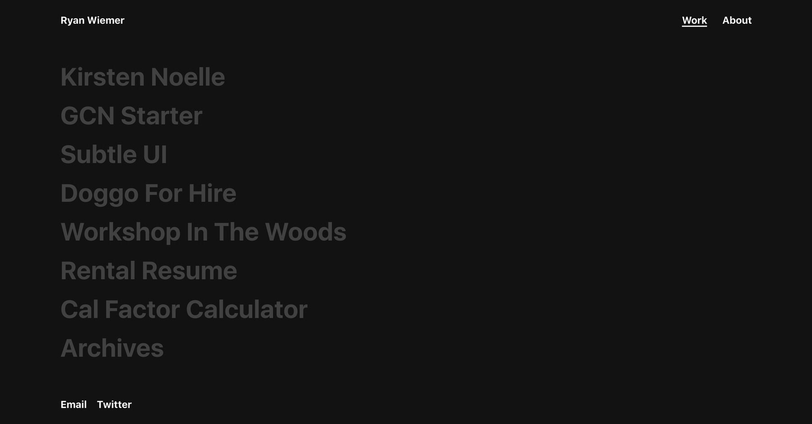

# [ryanwiemer.com](https://www.ryanwiemer.com)
Digital portfolio for Ryan Wiemer.




## Development
For local development a `.env` file in the root directory is required. It should contain the  following properties and their corresponding values found in Contentful. Please note that these are purposefully not included in the repo and you will get an error if you try to build the site without them.  

```
CONTENTFUL_SPACE_ID=
CONTENTFUL_DELIVERY_API_TOKEN=
```

**NOTE:** This repo is mostly just for me. It is publicly available if you are interested in exploring how it works or what I used. It is NOT a template. 


## Tools & Frameworks Used
* [Netlify](https://www.netlify.com/)
* [Contentful](https://www.contentful.com/)
* [Gatsby](https://www.gatsbyjs.org/)
* [React](https://reactjs.org/)
